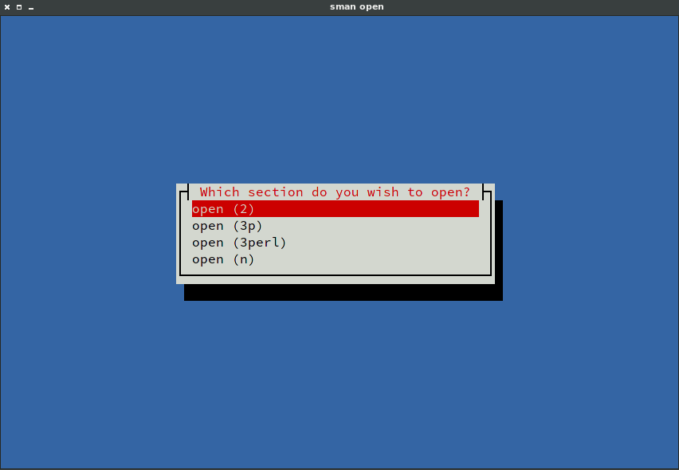

sman
====

Utility that lists the sections requested term is available in and allows
user to choose. Kind of like interactive `apropos`.

The idea comes from the OpenSuse’s man-db, which is patched to do this.

Built with [Rust](https://www.rust-lang.org/) and [ncurses](https://www.gnu.org/software/ncurses/ncurses.html) (using [Cursive](https://github.com/gyscos/Cursive) library).
